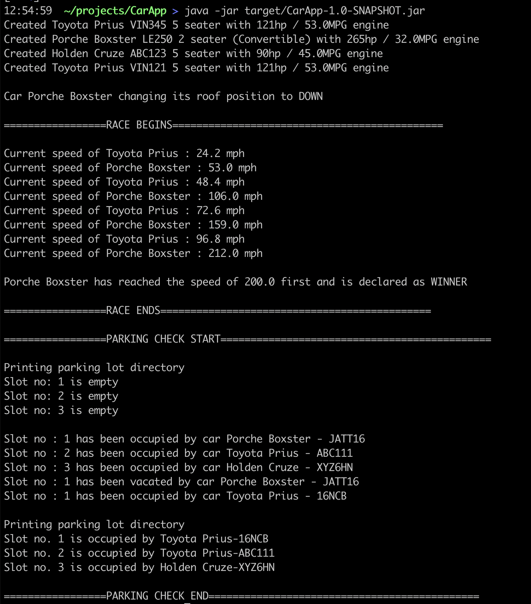

# Coding exercise as part of QCells interview process

Problem statement can be found [here](PROBLEM.md)

## Technical specs
- Java 11
- Maven 3

## Building locally (you will need Java 11 and Maven)
mvn clean install

## Building via docker
If you do not have jdk11 and maven installed locally, this project can be build using docker with command : 
`docker build -t qcells .`

## Running/Testing App locally
`java -jar target/CarApp-1.0-SNAPSHOT.jar`

## Running/Testing via docker
If you do not have jdk11 and maven installed locally, then run below command to run the App via docker :
`docker run qcells:latest`

## Future Improvements
- Add static code analysis (like PMD, Spotbugs)
- Add test coverage enforcerer (like Jacoco plugin)

## Author
Ramanjit Singh